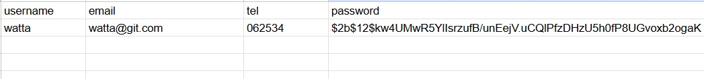

# Installation
```
pip install fastapi uvicorn jinja2 passlib bcrypt==4.3.0
```

# Start Project
```
uvicorn main:app --port 3000 --reload
```

# สร้าง Google Sheet API
- Google Cloud > new Service > Enabled APIs & services
- Enable Google Drive API
- Enable Google Sheets API
- เข้าไปที่ Manage Google Sheets API
- ไปที่ Credentials เลือก Create Credentials เลือก Service Account
- download key file .json ทำการบันทึกชื่อ credentials.json จากนั้นนำไปวางภายใต้ project

# การลงทะเบียน
เข้าผ่าน web browser
localhost:3000/register

